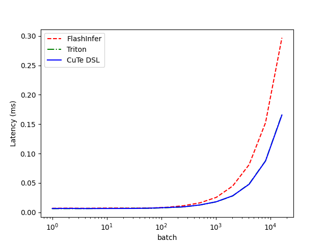

# cuda_auto_tune
NCU-driven iterative optimization workflow for CUDA/CUTLASS/Triton/CuTe DSL kernels. MANDATORY: every optimization MUST start with NCU profiling, followed by multi-dimensional analysis, then targeted code modification, then re-profiling to verify. Supports roofline, memory hierarchy, warp stalls, instruction mix, occupancy, divergence analysis. Provides implementation-specific code modifications: Native CUDA (launch config, memory patterns, async copy, Tensor Core), CUTLASS (ThreadblockShape, stages, epilogue, schedule policy, alignment), Triton (autotune params, compiler hints, tl.* API patterns), CuTe DSL (threads_per_cta, elems_per_thread, tiled_copy, copy atom, shared memory, warp/cta reduce). Use when optimizing any CUDA kernel performance.

The cuda-auto-tune skill can be applied to Claude Code, Cursor, Kiro, Codex, Kimi Code, and Qoder, etc. If you want to use cuda-auto-tune, you can directly use it in the current repository, or you can simply copy the cuda-auto-tune to the skills of the corresponding tool in other repositories for use.

# performance
- GPU: H20
- CUDA: 12.9
- Data Type: bf16
- Triton: 3.4.0
- Cute DSL: 4.4.2
- FlashInfer: 0.6.0
- Torch: 2.8.0

## RMSNorm

### hidden=4096

| batch | FlashInfer (ms) | Triton (ms) | CuTe DSL (ms) |
|------:|----------------:|------------:|--------------:|
| 1 | 0.006768 | 0.006393 | 0.006481 |
| 2 | 0.006521 | 0.006441 | 0.006396 |
| 4 | 0.006527 | 0.006117 | 0.006397 |
| 8 | 0.006883 | 0.006157 | 0.006437 |
| 16 | 0.006644 | 0.006511 | 0.006254 |
| 32 | 0.007336 | 0.006912 | 0.007252 |
| 64 | 0.006772 | 0.006633 | 0.006636 |
| 128 | 0.007832 | 0.007139 | 0.006725 |
| 256 | 0.008403 | 0.007915 | 0.007637 |
| 512 | 0.010616 | 0.008641 | 0.008608 |
| 1024 | 0.015112 | 0.012002 | 0.012046 |
| 2048 | 0.023690 | 0.017146 | 0.016674 |
| 4096 | 0.040962 | 0.026901 | 0.026532 |
| 8192 | 0.073679 | 0.045430 | 0.045071 |
| 16384 | 0.139146 | 0.083211 | 0.081659 |

---

### hidden=8192

| batch | FlashInfer (ms) | Triton (ms) | CuTe DSL (ms) |
|------:|----------------:|------------:|--------------:|
| 1 | 0.006882 | 0.006298 | 0.006457 |
| 2 | 0.007134 | 0.006320 | 0.006669 |
| 4 | 0.006868 | 0.006332 | 0.006431 |
| 8 | 0.007197 | 0.006669 | 0.006507 |
| 16 | 0.007304 | 0.006756 | 0.006584 |
| 32 | 0.007124 | 0.006892 | 0.006644 |
| 64 | 0.007320 | 0.006857 | 0.007125 |
| 128 | 0.008622 | 0.007932 | 0.008193 |
| 256 | 0.011179 | 0.009174 | 0.009320 |
| 512 | 0.016099 | 0.012475 | 0.012500 |
| 1024 | 0.025427 | 0.017858 | 0.017998 |
| 2048 | 0.044788 | 0.027947 | 0.028125 |
| 4096 | 0.081087 | 0.048212 | 0.047700 |
| 8192 | 0.152391 | 0.087569 | 0.087303 |
| 16384 | 0.296914 | 0.166528 | 0.165530 |

